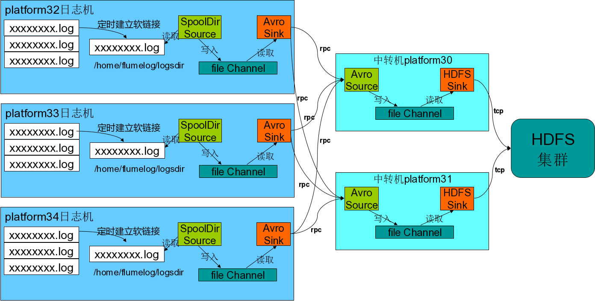

# 使用构建Flume1.3.0数据收集系统

## 目录
[Flume介绍](#1)         
[Flume是什么](#2)         
[Flume可靠性](#3)           
[Flume可用性](#4)           
[核心概念](#5)          
[核心概念：Event](#6)       
[核心概念：Client](#7)      
[核心概念：Agent](#8)           
[核心概念：Source](#9)      
[核心概念：Channel](#10)         
[核心概念：Sink](#11)       
[核心概念：Interceptor](#12)        
[核心概念：Channel Selector](#13)       
[核心概念：Sink Processor](#14)     
[Flume组件](#15)        
[Flume安装](#16)        
[通过Cloudera Manager安装](#17)     
[Flume配置使用](#18)     

## <a name="1">Flume介绍</a>

### <a name="2">Flume是什么</a>     

- 收集、聚合事件流数据的分布式框架。        
- 通常用于log数据。     
- 采用ad-hoc方案，明显优点如下：      
    - 可靠的、可伸缩、可管理、可定制、高性能。      
    - 声明式配置，可以动态更新配置。        
    - 提供上下文路由功能。      
    - 支持负载均衡和故障转移。      
    - 功能丰富。        
    - 完全的可扩展。        

### <a name="3">Flume可靠性</a>     

- Agent间事务的交换。
- Flow中，Channel的持久特性。

### <a name="4">Flume可用性</a> 

- 内建的Load balancing支持。
- 内建的Failover支持。

### <a name="5">核心概念</a>

- Event。
- Client。
- Agent。
- Sources、Channels、Sinks。
- 其他组件：Interceptors、Channel Selectors、Sink Processor。

### <a name="6">核心概念：Event</a>         

Event是Flume数据传输的基本单元。Flume以事件的形式将数据从源头传送到最终目的地。Event由可选的`Hearders`和载有数据的一个`byte array`所构成。Headers是容纳了key-value字符串对的无序集合，key在集合内是唯一的。Headers可以在上下文路由中使用。

        public interface Event {
          public Map<String, String> getHeaders();
          public void setHeaders(Map<String, String> headers);
          public byte[] getBody();
          public void setBody(byte[] body);

        }

### <a name="7">核心概念：Client</a>       

Clinet是一个将原始Log包装成Events并且发送它们到一个或多个Agent的实体。例如`Flume log4j Appender`。可以使用Client SDK (org.apache.flume.api)定制特定的Client。Client的目的是从数据源系统中解耦Flume，在Flume的拓扑结构中不是必须的。

### <a name="8">核心概念：Agent</a>     

一个Agent包含Sources, Channels, Sinks和其他组件，它利用这些组件将Events从一个节点传输到另一个节点或最终目的地。Agent是flume流的基础部分。Flume为这些组件提供了配置、生命周期管理及监控支持（监控现在还比较弱只提供了一个返回json监控数据的metrics URL）。

### <a name="9">核心概念：Source</a>        

Source负责接收Events或通过特殊机制产生Events，并将Events批量的放到一个或多个Channels。有Event驱动和轮询2种类型的Source。一个Agent可以配置多个Source，Source必须至少和一个channel关联。

不同类型的Source有:        

- 众所周知的系统集成的Sources: `Syslog(syslogtcp,multiport_syslogtcp,syslogudp), Netcat`。
- 自动生成事件的Sources: `SpoolDir, Exec, seq`。
- 用于Agent和Agent之间通信的IPC Sources: `Avro, thrift, jms, http`。

### <a name="10">核心概念：Channel</a>       

Channel位于Source和Sink之间，用于缓存进来的Events，当Sink成功的将Events发送到下一跳的Channel或最终目的，Events从Channel移除。Channels支持事务，提供较弱的顺序保证，可以和任何数量的Source和Sink工作。

不同的Channels提供不同的持久化水平: 

- Memory Channel: volatile。
- File Channel: 基于WAL（预写式日志Write-Ahead Logging）实现。
- JDBC Channel: 基于嵌入Database实现。

### <a name="11">核心概念：Sink</a>

Sink负责将Events传输到下一跳或最终目的地，成功完成后将Events从Channel中移除，Sink必须作用于一个确切的channel。

有不同类型的Sinks:      

- 存储events到最终目的的终端Sink. 比如: `HDFS, HBase, logger`。
- 自动消耗的Sinks. 比如: `Null Sink`。
- 用于Agent间通信的IPC sink: `Avro,thrift`。

### <a name="12">核心概念：Interceptor</a>

用于Source的一组Interceptor，按照预设的顺序在必要地方装饰和过滤Events。内建的Interceptors允许增加Event的Headers比如：时间戳、主机名、静态标记等等，定制的interceptors可以通过内省event payload（读取原始日志），在必要的地方创建一个特定的Headers。

### <a name="13">核心概念：Channel Selector</a>

Channel Selector允许Source基于预设的标准，从所有Channel中，选择一个或多个Channel。      
内建的Channel Selectors: 

- 复制Replicating: Event被复制到相关的Channel。
- 复用Multiplexing: 基于Hearder，Event被路由到特定的Channel。

### <a name="14">核心概念：Sink Processor</a>

多个Sink可以构成一个Sink Group。一个Sink Processor负责从一个指定的Sink Group中激活一个Sink。Sink Processor可以通过组中所有Sink实现负载均衡；也可以在一个Sink失败时转移到另一个。
Flume通过Sink Processor实现负载均衡（Load Balancing）和故障转移（failover）。所有的Sink都是采取轮询（polling）的方式从Channel上获取Events。这个动作是通过Sink Runner激活的
Sink Processor充当Sink的一个代理。

内建的Sink Processors: 

- Load Balancing Sink Processor：使用random, round_robin或定制的选择算法。
- Failover Sink Processor 。
- Default Sink Processor（单Sink）。

### <a name="15">Flume组件</a>

<table class="table table-bordered table-striped table-condensed">
   <tr>
      <td>Component Interface </td>
      <td>Type Alias </td>
      <td>Implementation Class</td>
   </tr>
   <tr>
      <td>org.apache.flume.Channel </td>
      <td>memory </td>
      <td>org.apache.flume.channel.MemoryChannel</td>
   </tr>
   <tr>
      <td>org.apache.flume.Channel </td>
      <td>jdbc </td>
      <td>org.apache.flume.channel.jdbc.JdbcChannel</td>
   </tr>
   <tr>
      <td>org.apache.flume.Channel </td>
      <td>recoverablememory </td>
      <td>org.apache.flume.channel.recoverable.memory.RecoverableMemoryChannel</td>
   </tr>
   <tr>
      <td>org.apache.flume.Channel </td>
      <td>file </td>
      <td>org.apache.flume.channel.file.FileChannel</td>
   </tr>
   <tr>
      <td>org.apache.flume.Channel </td>
      <td>– </td>
      <td>org.apache.flume.channel.PseudoTxnMemoryChannel</td>
   </tr>
   <tr>
      <td>org.apache.flume.Channel </td>
      <td>– </td>
      <td>org.example.MyChannel</td>
   </tr>
   <tr>
      <td>org.apache.flume.Source </td>
      <td>avro </td>
      <td>org.apache.flume.source.AvroSource</td>
   </tr>
   <tr>
      <td>org.apache.flume.Source </td>
      <td>netcat </td>
      <td>org.apache.flume.source.NetcatSource</td>
   </tr>
   <tr>
      <td>org.apache.flume.Source </td>
      <td>seq </td>
      <td>org.apache.flume.source.SequenceGeneratorSource</td>
   </tr>
   <tr>
      <td>org.apache.flume.Source </td>
      <td>exec </td>
      <td>org.apache.flume.source.ExecSource</td>
   </tr>
   <tr>
      <td>org.apache.flume.Source </td>
      <td>syslogtcp </td>
      <td>org.apache.flume.source.SyslogTcpSource</td>
   </tr>
   <tr>
      <td>org.apache.flume.Source </td>
      <td>multiport_syslogtcp </td>
      <td>org.apache.flume.source.MultiportSyslogTCPSource</td>
   </tr>
   <tr>
      <td>org.apache.flume.Source </td>
      <td>syslogudp </td>
      <td>org.apache.flume.source.SyslogUDPSource</td>
   </tr>
   <tr>
      <td>org.apache.flume.Source </td>
      <td>spooldir </td>
      <td>org.apache.flume.source.SpoolDirectorySource</td>
   </tr>
   <tr>
      <td>org.apache.flume.Source </td>
      <td>http </td>
      <td>org.apache.flume.source.http.HTTPSource</td>
   </tr>
   <tr>
      <td>org.apache.flume.Source </td>
      <td>thrift </td>
      <td>org.apache.flume.source.ThriftSource</td>
   </tr>
   <tr>
      <td>org.apache.flume.Source </td>
      <td>jms </td>
      <td>org.apache.flume.source.jms.JMSSource</td>
   </tr>
   <tr>
      <td>org.apache.flume.Source </td>
      <td>– </td>
      <td>org.apache.flume.source.avroLegacy.AvroLegacySource</td>
   </tr>
   <tr>
      <td>org.apache.flume.Source </td>
      <td>– </td>
      <td>org.apache.flume.source.thriftLegacy.ThriftLegacySource</td>
   </tr>
   <tr>
      <td>org.apache.flume.Source </td>
      <td>– </td>
      <td>org.example.MySource</td>
   </tr>
   <tr>
      <td>org.apache.flume.Sink </td>
      <td>null </td>
      <td>org.apache.flume.sink.NullSink</td>
   </tr>
   <tr>
      <td>org.apache.flume.Sink </td>
      <td>logger </td>
      <td>org.apache.flume.sink.LoggerSink</td>
   </tr>
   <tr>
      <td>org.apache.flume.Sink </td>
      <td>avro </td>
      <td>org.apache.flume.sink.AvroSink</td>
   </tr>
   <tr>
      <td>org.apache.flume.Sink </td>
      <td>hdfs </td>
      <td>org.apache.flume.sink.hdfs.HDFSEventSink</td>
   </tr>
   <tr>
      <td>org.apache.flume.Sink </td>
      <td>hbase </td>
      <td>org.apache.flume.sink.hbase.HBaseSink</td>
   </tr>
   <tr>
      <td>org.apache.flume.Sink </td>
      <td>asynchbase </td>
      <td>org.apache.flume.sink.hbase.AsyncHBaseSink</td>
   </tr>
   <tr>
      <td>org.apache.flume.Sink </td>
      <td>elasticsearch </td>
      <td>org.apache.flume.sink.elasticsearch.ElasticSearchSink</td>
   </tr>
   <tr>
      <td>org.apache.flume.Sink </td>
      <td>file_roll </td>
      <td>org.apache.flume.sink.RollingFileSink</td>
   </tr>
   <tr>
      <td>org.apache.flume.Sink </td>
      <td>irc </td>
      <td>org.apache.flume.sink.irc.IRCSink</td>
   </tr>
   <tr>
      <td>org.apache.flume.Sink </td>
      <td>thrift </td>
      <td>org.apache.flume.sink.ThriftSink</td>
   </tr>
   <tr>
      <td>org.apache.flume.Sink </td>
      <td>– </td>
      <td>org.example.MySink</td>
   </tr>
   <tr>
      <td>org.apache.flume.ChannelSelector </td>
      <td>replicating </td>
      <td>org.apache.flume.channel.ReplicatingChannelSelector</td>
   </tr>
   <tr>
      <td>org.apache.flume.ChannelSelector </td>
      <td>multiplexing </td>
      <td>org.apache.flume.channel.MultiplexingChannelSelector</td>
   </tr>
   <tr>
      <td>org.apache.flume.ChannelSelector </td>
      <td>– </td>
      <td>org.example.MyChannelSelector</td>
   </tr>
   <tr>
      <td>org.apache.flume.SinkProcessor </td>
      <td>default </td>
      <td>org.apache.flume.sink.DefaultSinkProcessor</td>
   </tr>
   <tr>
      <td>org.apache.flume.SinkProcessor </td>
      <td>failover </td>
      <td>org.apache.flume.sink.FailoverSinkProcessor</td>
   </tr>
   <tr>
      <td>org.apache.flume.SinkProcessor </td>
      <td>load_balance </td>
      <td>org.apache.flume.sink.LoadBalancingSinkProcessor</td>
   </tr>
   <tr>
      <td>org.apache.flume.SinkProcessor </td>
      <td>– </td>
      <td> </td>
   </tr>
   <tr>
      <td>org.apache.flume.interceptor.Interceptor </td>
      <td>timestamp </td>
      <td>org.apache.flume.interceptor.TimestampInterceptor$Builder</td>
   </tr>
   <tr>
      <td>org.apache.flume.interceptor.Interceptor </td>
      <td>host </td>
      <td>org.apache.flume.interceptor.HostInterceptor$Builder</td>
   </tr>
   <tr>
      <td>org.apache.flume.interceptor.Interceptor </td>
      <td>static </td>
      <td>org.apache.flume.interceptor.StaticInterceptor$Builder</td>
   </tr>
   <tr>
      <td>org.apache.flume.interceptor.Interceptor </td>
      <td>regex_filter </td>
      <td>org.apache.flume.interceptor.RegexFilteringInterceptor$Builder</td>
   </tr>
   <tr>
      <td>org.apache.flume.interceptor.Interceptor </td>
      <td>regex_extractor </td>
      <td>org.apache.flume.interceptor.RegexFilteringInterceptor$Builder</td>
   </tr>
   <tr>
      <td>org.apache.flume.channel.file.encryption.KeyProvider$Builder </td>
      <td>jceksfile </td>
      <td>org.apache.flume.channel.file.encryption.JCEFileKeyProvider</td>
   </tr>
   <tr>
      <td>org.apache.flume.channel.file.encryption.KeyProvider$Builder </td>
      <td>– </td>
      <td>org.example.MyKeyProvider</td>
   </tr>
   <tr>
      <td>org.apache.flume.channel.file.encryption.CipherProvider </td>
      <td>aesctrnopadding </td>
      <td>org.apache.flume.channel.file.encryption.AESCTRNoPaddingProvider</td>
   </tr>
   <tr>
      <td>org.apache.flume.channel.file.encryption.CipherProvider </td>
      <td>– </td>
      <td>org.example.MyCipherProvider</td>
   </tr>
   <tr>
      <td>org.apache.flume.serialization.EventSerializer$Builder </td>
      <td>text </td>
      <td>org.apache.flume.serialization.BodyTextEventSerializer$Builder</td>
   </tr>
   <tr>
      <td>org.apache.flume.serialization.EventSerializer$Builder </td>
      <td>avro_event </td>
      <td>org.apache.flume.serialization.FlumeEventAvroEventSerializer$Builder</td>
   </tr>
   <tr>
      <td>org.apache.flume.serialization.EventSerializer$Builder </td>
      <td>– </td>
      <td>org.example.MyEventSerializer$Builder</td>
   </tr>
</table>

## <a name="16">Flume安装</a>

### <a name="17">通过Cloudera Manager安装</a>

直接添加Flume服务即可，Flume-ng架构比较简单，只有统一的Agent，只需要在需要安装Flume的机器上选择安装Agent即可。

## <a name="18">Flume配置使用</a>

配置方案：日志机安装flume agent从指定目录获取日志通过avro 压缩的方案传输到中转机，在每个日志机传输到转机时配置failover的方式保证日志传输的安全性。

如下面的配置设置platform32, platform33, platform34为日志机，platform30， platform31为中转机。

部署如图所示：

- platform32, platform33, platform34日志机的配置为：

        #==== flume1.3.0的配置 ======== 1.3.0日志节点配置========================
        uc_agent.sources = ucweblog
        uc_agent.sinks = uclogsink1 uclogsink2
        uc_agent.channels = ucfilechannel
        uc_agent.sinkgroups = uclogsinkgroups

        # 配置uc_agent.sources为spoolDir的方式
        uc_agent.sources.ucweblog.type = spoolDir
        uc_agent.sources.ucweblog.spoolDir = /home/flumelog/logsdir
        uc_agent.sources.ucweblog.deletePolicy = never
        uc_agent.sources.ucweblog.fileHeader = true
        uc_agent.sources.ucweblog.deserializer = LINE
        uc_agent.sources.ucweblog.deserializer.maxLineLength = 20480

        # 配置uc_agent.sinks为支持压缩的AvroSink
        uc_agent.sinks.uclogsink1.type = avro
        uc_agent.sinks.uclogsink1.compression-type = deflate
        uc_agent.sinks.uclogsink1.compression-level = 9
        uc_agent.sinks.uclogsink1.hostname = platform30
        uc_agent.sinks.uclogsink1.port = 11000

        uc_agent.sinks.uclogsink2.type = avro
        uc_agent.sinks.uclogsink2.compression-type = deflate
        uc_agent.sinks.uclogsink2.compression-level = 9
        uc_agent.sinks.uclogsink2.hostname = platform31
        uc_agent.sinks.uclogsink2.port = 11000

        uc_agent.sinkgroups.uclogsinkgroups.sinks = uclogsink1 uclogsink2
        uc_agent.sinkgroups.uclogsinkgroups.processor.type = failover
        uc_agent.sinkgroups.uclogsinkgroups.processor.priority.uclogsink1 = 5
        uc_agent.sinkgroups.uclogsinkgroups.processor.priority.uclogsink2 = 10
        uc_agent.sinkgroups.uclogsinkgroups.processor.maxpenalty = 10000

        # 配置uc_agent.channels为file channel
        uc_agent.channels.ucfilechannel.type = file
        uc_agent.channels.ucfilechannel.checkpointDir = /home/flumelog/checkpoint
        uc_agent.channels.ucfilechannel.dataDirs = /home/flumelog/data
        uc_agent.channels.ucfilechannel.capacity = 2000000
        uc_agent.channels.ucfilechannel.transactionCapacity = 1000

        # 配置source与sink的channels的绑定
        uc_agent.sources.ucweblog.channels = ucfilechannel
        uc_agent.sinks.uclogsink1.channel = ucfilechannel
        uc_agent.sinks.uclogsink2.channel = ucfilechannel

- platform30， platform31中转机的配置为：

        #==== flume1.3.0带failover的配置 ======= 1.3.0汇聚节点配置 ==============
        uc_c_agent.sources = ucweblog-c
        uc_c_agent.sinks = uclogsink-c
        uc_c_agent.channels = ucfilechannel-c

        # 配置sources
        uc_c_agent.sources.ucweblog-c.type = avro
        uc_c_agent.sources.ucweblog-c.compression-type = deflate
        uc_c_agent.sources.ucweblog-c.bind = 0.0.0.0
        uc_c_agent.sources.ucweblog-c.port = 11000
        uc_c_agent.sources.ucweblog-c.threads = 50
        uc_c_agent.sources.ucweblog-c.interceptors = i0 i1
        uc_c_agent.sources.ucweblog-c.interceptors.i0.type = timestamp
        uc_c_agent.sources.ucweblog-c.interceptors.i1.type=regex_extractor
        uc_c_agent.sources.ucweblog-c.interceptors.i1.regex=\t(\d{4}-\d{2}-\d{2} \d{2}:\d{2}:\d{2})\t
        uc_c_agent.sources.ucweblog-c.interceptors.i1.serializers=s1
        uc_c_agent.sources.ucweblog-c.interceptors.i1.serializers.s1.type=org.apache.flume.interceptor.RegexExtractorInterceptorMillisSerializer
        uc_c_agent.sources.ucweblog-c.interceptors.i1.serializers.s1.name=timestamp
        uc_c_agent.sources.ucweblog-c.interceptors.i1.serializers.s1.pattern=yyyy-MM-dd HH:mm:ss

        # 配置sinks
        uc_c_agent.sinks.uclogsink-c.type = hdfs
        uc_c_agent.sinks.uclogsink-c.hdfs.path = hdfs://nameservice1/user/flume/%Y/%m/%d
        uc_c_agent.sinks.uclogsink-c.hdfs.fileType = CompressedStream
        uc_c_agent.sinks.uclogsink-c.hdfs.codeC = com.hadoop.compression.lzo.LzopCodec
        uc_c_agent.sinks.uclogsink-c.hdfs.filePrefix=uclog-%Y%m%d-%H0000000
        uc_c_agent.sinks.uclogsink-c.hdfs.rollInterval=6000
        uc_c_agent.sinks.uclogsink-c.hdfs.rollSize=0
        uc_c_agent.sinks.uclogsink-c.hdfs.rollCount=0
        uc_c_agent.sinks.uclogsink-c.hdfs.writeFormat=Text
        uc_c_agent.sinks.uclogsink-c.hdfs.batchSize=1000

        # 配置channels
        uc_c_agent.channels.ucfilechannel-c.type = file
        uc_c_agent.channels.ucfilechannel-c.checkpointDir = /home/flumelog/checkpoint
        uc_c_agent.channels.ucfilechannel-c.dataDirs = /home/flumelog/data
        uc_c_agent.channels.ucfilechannel-c.capacity = 2000000
        uc_c_agent.channels.ucfilechannel-c.transactionCapacity = 1000

        # 配置source与sink的channel绑定
        uc_c_agent.sources.ucweblog-c.channels = ucfilechannel-c
        uc_c_agent.sinks.uclogsink-c.channel = ucfilechannel-c

