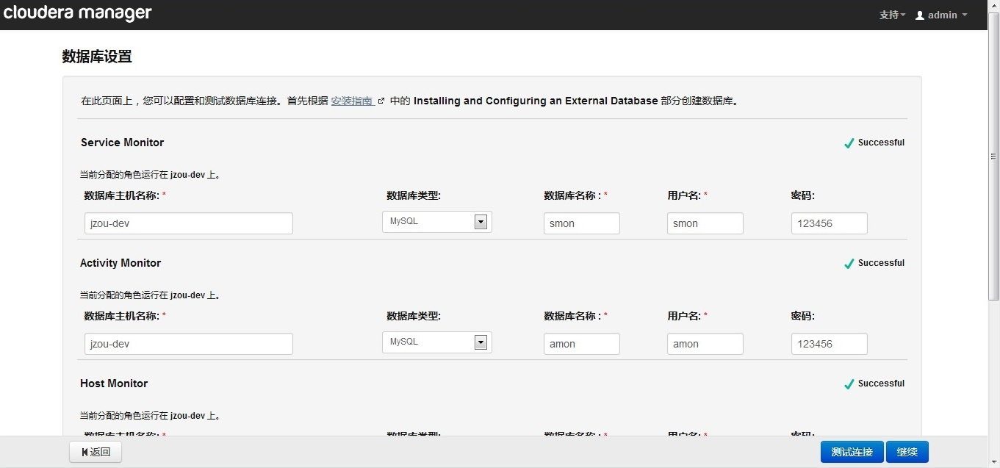

# MyHadoop 安装与配置

### 说明
MyHadoop基于Cloudera Manager（CM）和CDH, 为了解决安装CM与CDH需要从国外下载CM与CDH且这两个东西都比较大且下载速度不是很稳定，通常在
安装过程中需要等待很长的时间下载，造成安装过程缓慢，为此，此工程将通过CM的tar包和CDH的Parcels包裹安装CM和CDH.

每个CDH集群都有批量修改配置的需求，在CM上可以通过界面修改配置，的确很方便，但在部署安装后需要修改配置的项比较多，通过界面就比较费时了，
MyHadoop同样提供了脚本通过修改配置文件统一修改所有服务配置(CDH_configs_V4.py以实例覆盖的方式修改各个主机上（hosts_name.txt中的主机）
的配置文件，CDH_configs_V2.py以服务角色的方式统一修改配置默认值，CDH_configs_V2.py方式修改的配置可以被新增加的机器继承)。

MyHadoop使用Mysql数据，会自行安装与配置，数据库密码通过配置获得，默认为123456

> 注： myhadoop-install安装现在支持的操作系统为RedHat系列的5，6

> Cloudera Manager使用MySQL

> myhadoop-install需要python2.5+

> RedHat系列的5升级安装python2.6

	  	rpm -ivh http://dl.iuscommunity.org/pub/ius/stable/Redhat/5/x86_64/epel-release-5-4.noarch.rpm
	  	rpm -ivh http://dl.iuscommunity.org/pub/ius/stable/Redhat/5/x86_64/ius-release-1.0-11.ius.el5.noarch.rpm
		yum -y install python26 python26-devel
		ln -sf /usr/bin/python26 /usr/bin/python
		vim /usr/bin/yum    python->python2.4

> RedHat系列的5升级安装python2.7

	   	rpm -ivh http://dl.iuscommunity.org/pub/ius/stable/Redhat/5/x86_64/epel-release-5-4.noarch.rpm
	   	rpm -ivh http://dl.iuscommunity.org/pub/ius/stable/Redhat/5/x86_64/ius-release-1.0-11.ius.el5.noarch.rpm
		yum -y install python27 python27-devel
		ln -sf /usr/bin/python2.7 /usr/bin/python
		vim /usr/bin/yum    python->python2.4

> 安装需要gcc44, 如果没有gcc44可以通过`yum -y install gcc44`

> 源码升级安装python2.75

    wget "http://www.python.org/ftp/python/2.7.5/Python-2.7.5.tar.bz2" 
    tar -xvf Python-2.7.5.tar.bz2  
    cd Python-2.7.5 && ./configure && make && make install && cd ../ && rm -rf Python-2.7.5*

- 主要文件介绍

    - cm_conf目录下的cnfs.py是配置文件CM安装目录、CM tar包名，CM登录信息、mysql密码、ssh端口等。

    - install.sh是安装脚本，使用方式：`sh ./install.sh <root_pass> `  root_pass为root用户密码。

    - add_node.py是增加机器节点脚本，是在集群安装好后，需要再次增加新的机器到该集群中，使用此脚本， 使用方式：
    `python add_node.py <root_pass> [node1 node2]`或者`python add_node.py <root_pass>`主机列表通过修改add_node.py文件中的
    hostnams列表。

    - CDH_configs_V2.py 是以服务角色的方式统一修改配置默认值的CDH配置信息的配置文件。

    - Config_CDH_V2.py 使用`CDH_configs_V2.py`配置文件信息对CDH服务进行配置，使用方式 `python Config_CDH_V2.py`。

    - CDH_configs_V4.py 是以实例覆盖的方式修改各个主机上（`hosts_name.txt`中的主机）的各服务角色配置信息的配置文件。

    - Config_CDH_V4.py 使用`CDH_configs_V4.py`配置文件信息对CDH服务进行配置，使用方式` python Config_CDH_V4.py`。

## 安装

#### 准备工作

- 下载myhadoop-install到安装本地

- 下载CM及CDH（这里以cloudera-manager-el6-cm4.6.2_x86_64.tar.gz及CDH-4.2.1-1.cdh4.2.1.p0.5-el6.parcel为例）

    - 到`http://archive.cloudera.com/cm4/cm/4/`下载操作系统对应的tar（cloudera-manager-el6-cm4.6.2_x86_64.tar.gz）安装并把
    它放入tars目录中

    - 到Oracle网站下载tar.gz格式的JDK，并把它放入tars目录中

    - 到`http://archive.cloudera.com/cdh4/parcels/`下载你想要安装的CDH版本（如这里下载
    `http://archive.cloudera.com/cdh4/parcels/4.2.1/CDH-4.2.1-1.cdh4.2.1.p0.5-el6.parcel`并把下载
    `http://archive.cloudera.com/cdh4/parcels/4.2.1/manifest.json`这个json文件包含我们所需要的CDH的hash值）。把下载的.parcel
    文件放入parcels,同时在parscels目录下创建一个以CDH包全名为名的.sha文件(CDH-4.2.1-1.cdh4.2.1.p0.5-el6.parcel.sha) 此文件的内
    容的一个hash值，这个hash值从manifest.json中获得（如本例中找到`CDH-4.2.1-1.cdh4.2.1.p0.5-el6.parcel`所在对应的
    `"hash": "20532c88d0b5080db86821c85c14b2295329a6c0"`, 把此hash值`20532c88d0b5080db86821c85c14b2295329a6c0`作为.sha文件
    的内容,以`echo 20532c88d0b5080db86821c85c14b2295329a6c0 > parcels/CDH-4.2.1-1.cdh4.2.1.p0.5-el6.parcel.sha`产生）。

- 修改hosts_name.txt

    在hosts_name.txt文件中写上所有需要安装的hostname，一行一个主机名。

- 配置cm_conf/confs.py配置文件

        ssh_port = 22  #各机器的ssh端口。

        mysql_pass = '123456' # CM使用及Hive使用的Mysql密码，同时也是将设置为Mysql的root用户的密码为此密码。

        cm_install_dir = '/home/cloudera-manager' # CM的安装路径
        cm_tar = 'cloudera-manager-el6-cm4.6.2_x86_64.tar.gz'  # CM的包名
        CMF_ROOT = '%s/cm-4.6.2' % cm_install_dir # cm-4.6.2为CM tar包解压后的目录名

        jdk_tar_name = 'jdk-7u3-linux-x64.tar.gz'
        jdk_unpack_name = 'jdk1.7.0_03'

- 配置各机器的/etc/hosts文件， 如：

        192.168.30.101      hadoop1
        192.168.30.102      hadoop2
        192.168.30.102      hadoop3
        192.168.30.102      hadoop4
        192.168.30.102      hadoop5

    > 注意主机名不能配置错误，不要同一主机含有多个域名。

- 关闭selinux

        setenforce 0
        #或者
        /etc/selinux/config：SELINUX=disabled
- 关闭防火墙

        /etc/init.d/iptables stop

- 需要root用户安装

- 确保root用户可以SSH登录各机器

- 确保yum可以使用，可以通过yum安装软件

- 确保执行安装的机器能联外网（执行安装的机器将安装mysql, CM Server）

- 确保各个机器时间同步

#### 安装过程

- 运行./install.sh <root_password> 进行安装

    安装过程不用交互，安装成功后会提示成功，及提供登录管理的地址

- 登录http://hostname:7180/, 用户名与密码为admin

    

- 选择标准版如图， 然后下一步

    

- 如图 继续

    

- 如图 选择当前管理的主机，把所有主机勾选上（因为我们已经安装好的agent且都已启动起来了，所以安装了agent的主机已被管理），继续下一步

    

- 如图 选择你所放在parcels的版本（CDH-4.2.1-1.cdh4.2.1.p0.5）（因为我们已下载好的包裹，这样就不会再去网络下载了，
而是直接分发到其它机器） 继续下一步

    

- 如图 等待CDH分发到各主机后，继续下一步

    
    （这里不会下载了，直接进行分发，可以包裹中看到如图）
    

- 如图 进行主机检查，可以跳过，断续下一步。

    

- 如图 选择所要安装的服务后，点击 检查角色分配，可进行角色的调整，在角色调整后。断续下一步。

    

- 如图 输入数据库名，用户和密码 测试连接成功后，断续下一步。

    

- 如图 修改数据目录，Myhadoop默认把数据存于/home/CDH-data目录下，断续下一步。

    

    Myhadoop默认把数据存于`home/CDH-data`目录下,如图配置`/home/CDH-data/dn` 、 `/home/CDH-data/nn` 、 `/home/CDH-data/snn`
    等。

- 如图 启动集群服务后，断续下一步。

    

- 完成安装，此时安装服务都起动了。

#### 参数配置

- 使用V2对CDH进行配置

    - 修改CDH_configs_V2.py配置文件中各CDH服务对应的配置项，没有安装的CDH服务不用修改

    - 执行 python Config_CDH_V2.py进行参数配置修改。

    - 重起整个集群，使用配置生效

    - 部署集群客户端配置

- 使用V4对CDH进行配置

    - 修改CDH_configs_V4.py配置文件中各CDH服务对应的配置项，没有安装的CDH服务不用修改

    - 执行 python Config_CDH_V4.py进行参数配置修改。

    - 重起整个集群，使用配置生效

    - 部署集群客户端配置

#### 增加机器

- 执行python add_node.py <root_pass> [hostname1 hostname2....]

    安装成功后，会在新增加的机器上安装好Cloudera Manager Agent并已启动。

- 登录CM管理台，在主机菜单选择增加主机。

- 选择当前管理的主机，把所有主机勾选上。

- 为新增加的机器分配服务角色。

- 如果使用V2对CDH进行配置，则新增加的机器会继承已配置的值。
